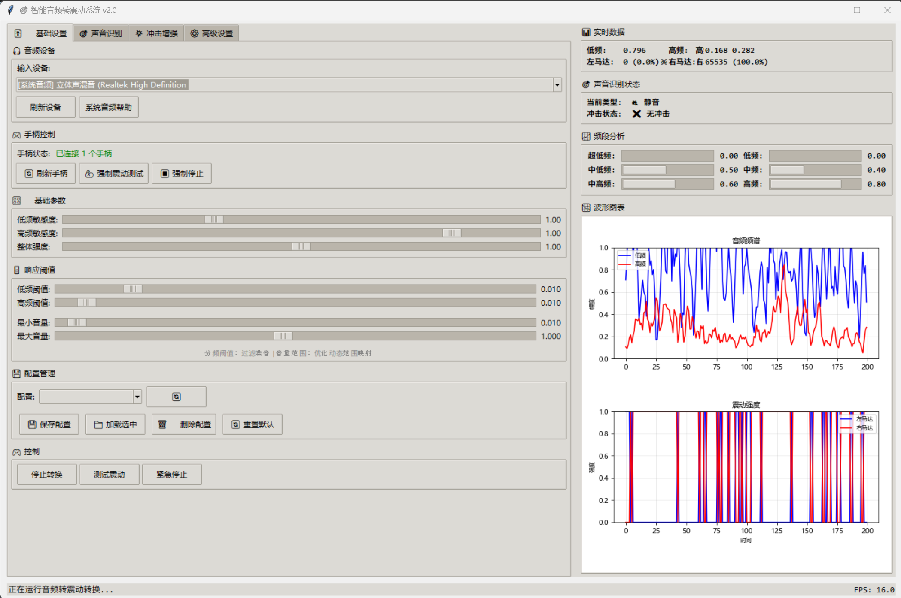

# 🎮 Audio to Controller Vibration | 音频转手柄震动

[](https://python.org)
[](https://windows.microsoft.com)
[](https://docs.microsoft.com/en-us/windows/win32/xinput/xinput-game-controller-apis-portal)
[](LICENSE)

> **将音频实时转换为手柄震动反馈的高性能Python应用程序**
> *Real-time audio to controller vibration feedback with advanced sound processing*

## 📸 演示 | Demo



## ✨ 主要特性 | Key Features

### 🔊 **先进音频处理 | Advanced Audio Processing**

- ⚡ **低延迟处理** - 默认512 samples（44.1kHz下约11.6ms）的实时音频块
- 🎵 **智能频率分离** - 自动分离低频和高频信号
- 🌈 **6频段分析** - 从超低音到高音的全频段解析
- 🎯 **声音识别** - 自动识别爆炸、金属撞击等特殊音效
- 💥 **冲击增强** - 检测音频突变并增强震动反馈

### 🎮 **强大震动控制 | Powerful Vibration Control**

- 🕹️ **XInput兼容** - 支持Xbox手柄和兼容设备
- 🎛️ **精细调节** - 独立控制左右马达强度和频率
- ⚙️ **差异化震动** - 根据声音类型提供不同震动模式
- 🔄 **热插拔支持** - 运行时动态连接和断开手柄
- 🧪 **强制震动测试** - 即使未检测到手柄也可测试

### 🖥️ **直观用户界面 | Intuitive User Interface**

- 📊 **实时监控** - 可视化音频频谱和震动强度
- 📁 **配置管理** - 保存和加载个性化设置方案
- 🎨 **中文界面** - 完整本地化支持
- 📈 **实时图表** - matplotlib集成的专业级数据可视化
- 🎚️ **标签式布局** - 清晰分类的功能面板

### 🎧 **多音频源支持 | Multi-Audio Source Support**

- 🎤 **麦克风输入** - 支持所有音频输入设备
- 🔊 **系统音频** - 通过立体声混音捕获播放中的音乐/游戏
- 🎮 **游戏音效** - 实时处理游戏音频转换为触觉反馈
- 🎬 **影音娱乐** - 增强电影和音乐的沉浸体验

## 🛠️ 系统要求 | System Requirements

### **操作系统 | Operating System**

- Windows 10/11 (推荐 | Recommended)
- Windows 7/8.1 (基本支持 | Basic Support)

### **硬件 | Hardware**

- XInput兼容手柄 (Xbox 360/One/Series 控制器)
- 音频输入设备 (麦克风或立体声混音)
- 支持音频输出的设备

### **软件环境 | Software Environment**

- Python 3.7 或更高版本
- pip 包管理器

## 🚀 快速安装 | Quick Installation

### **1. 克隆仓库 | Clone Repository**

```bash
git clone https://github.com/Kirin-0321/audio-to-controller-vibration.git
cd audio-to-controller-vibration
```

### **2. 安装依赖 | Install Dependencies**

```bash
pip install -r requirements.txt
```

### **3. 启动程序 | Launch Application**

**方法一：直接启动 | Direct Launch**

```bash
python main.py
```

**方法二：管理员启动 (推荐) | Admin Launch (Recommended)**

- 双击 `启动程序.bat` 文件
- 或运行: `python main.py --chunk-size 512`

## 📖 详细使用指南 | Detailed Usage Guide

### **🎮 控制器设置 | Controller Setup**

1. **连接XInput兼容手柄**

   - 有线连接或蓝牙配对
   - 确保Windows识别为XInput设备
2. **手柄检测与测试**

   ```python
   # 测试手柄连接
   python test/xinput_controller_test.py
   ```
3. **GUI中的手柄控制**

   - 🔄 **刷新手柄** - 重新扫描连接的设备
   - 💪 **强制震动测试** - 测试震动功能
   - ⏹️ **强制停止** - 立即停止所有震动

#### **游戏原生震动优先 | Game Feedback Priority**

参考 DSX 3.2 将 Game Feedback 与 Audio/Haptics 分开处理的思路，本项目支持把“游戏原生震动”作为优先信号：

- 有游戏震动反馈时，自动降低音频生成震动
- 游戏震动保持主导，音频震动只补充剩余马达动态余量
- 游戏震动结束后，音频震动以较慢释放恢复，避免突然跳变
- GUI 可调“音频减弱强度”和“音频最低保留”

普通 XInput 只能发送震动，不能直接读取游戏刚刚请求的震动值，因此需要虚拟手柄或其他反馈源把游戏震动回调交给程序。`ControllerManager` 已提供兼容 ViGEm/vgamepad 风格的入口：

```python
# virtual_pad 为支持 register_notification(...) 的虚拟手柄对象
controller_manager.attach_game_feedback_source(virtual_pad)
```

也可以直接从自定义反馈源写入：

```python
controller_manager.update_game_vibration_feedback(
    large_motor,
    small_motor,
    max_value=255,
    source='virtual_x360'
)
```

### **🎧 音频源配置 | Audio Source Configuration**

#### **立体声混音设置 (推荐)**

1. 右键系统托盘音量图标
2. 选择 "录制设备" 或 "声音设置"
3. 启用 "立体声混音" 设备
4. 设为默认录制设备

#### **系统音频输出到双设备**

```
主输出设备 → 扬声器/耳机
同时输出 → 立体声混音 → 程序捕获
```

### **⚙️ 参数调节指南 | Parameter Tuning Guide**

#### **基础设置 | Basic Settings**

- **低频敏感度 (Low Freq Sensitivity)**: `0.5-3.0` - 控制低音震动强度
- **高频敏感度 (High Freq Sensitivity)**: `0.5-3.0` - 控制高音震动强度
- **总体强度 (Overall Intensity)**: `0.1-2.0` - 全局震动倍数
- **频率分离点 (Frequency Cutoff)**: `200-800Hz` - 低/高频分界点

#### **高级设置 | Advanced Settings**

- **平滑因子 (Smoothing Factor)**: `0.0-0.9` - 震动变化的平滑程度
- **攻击时间 (Attack Time)**: `0.01-1.0s` - 震动启动速度
- **衰减时间 (Decay Time)**: `0.1-2.0s` - 震动衰减速度
- **频率差增强 (Frequency Difference)**: `0.0-1.0` - 增强频率间的差异

#### **音量阈值 | Volume Thresholds**

- **最小音量阈值**: `0.001-0.1` - 触发震动的最小音量
- **最大音量阈值**: `0.5-1.0` - 震动饱和点
- **低频最小阈值**: `0.001-0.3` - 低频马达触发阈值
- **高频最小阈值**: `0.001-0.3` - 高频马达触发阈值

## 🎯 使用场景 | Use Cases

### **🎮 游戏增强 | Gaming Enhancement**

```json
{
  "low_freq_sensitivity": 1.5,
  "high_freq_sensitivity": 2.0,
  "sound_classification": true,
  "impact_enhancement": true,
  "explosion_boost": 3.0
}
```

### **🎬 影音体验 | Movie Experience**

```json
{
  "low_freq_sensitivity": 2.0,
  "high_freq_sensitivity": 1.2,
  "smoothing_factor": 0.3,
  "attack_time": 0.2,
  "decay_time": 0.8
}
```

### **🎵 音乐欣赏 | Music Listening**

```json
{
  "low_freq_sensitivity": 1.8,
  "high_freq_sensitivity": 1.5,
  "frequency_cutoff": 300,
  "smoothing_factor": 0.2
}
```

## 📁 配置管理 | Configuration Management

### **保存配置 | Save Configuration**

1. 在GUI中调节参数到满意状态
2. 点击 "💾 保存配置"
3. 输入配置名称 (如 "我的游戏设置")
4. 配置保存至 `config/` 文件夹

### **加载配置 | Load Configuration**

1. 从下拉菜单选择已保存的配置
2. 点击 "📂 加载配置" 应用设置
3. 或双击配置名称快速加载

### **重置配置 | Reset Configuration**

- 点击 "🔄 重置默认" 恢复到 `default_config.json` 设置

## 🐛 故障排除 | Troubleshooting

### **❌ 常见问题 | Common Issues**

#### **手柄未检测到**

```bash
# 1. 检查手柄连接
python test/xinput_controller_test.py

# 2. 更新手柄驱动
# 3. 使用"刷新手柄"功能
# 4. 尝试"强制震动测试"
```

#### **无音频输入**

```bash
# 1. 检查音频设备
python main.py --list-devices

# 2. 启用立体声混音
python test/system_audio_setup.py

# 3. 检查设备权限
```

#### **延迟过高**

```bash
# 1. 降低缓冲区大小
python main.py --chunk-size 16

# 2. 启用高优先级 (默认启用)
python main.py --no-high-priority  # 禁用对比

# 3. 关闭不必要的后台程序
```

#### **中文显示异常**

- GUI会自动检测中文字体 (Microsoft YaHei)
- 如仍显示异常，请安装中文字体包

### **🔧 诊断工具 | Diagnostic Tools**

```bash
# 手柄连接测试
python test/xinput_controller_test.py

# 系统音频设置
python test/system_audio_setup.py

# 延迟测试配置
python test/test_latency_configs.py
```

## 📚 文档 | Documentation

详细文档位于 `md/` 文件夹：

- [**性能优化指南**](md/PERFORMANCE_GUIDE.md) - 延迟优化和性能调优
- [**声音识别说明**](md/SOUND_CLASSIFICATION_GUIDE.md) - 高级音频分析功能
- [**参数详解**](md/PARAMETER_EXPLANATION.md) - 所有参数的详细说明
- [**频率差增强**](md/FREQUENCY_DIFFERENCE_GUIDE.md) - 频率差参数使用指南
- [**音量阈值配置**](md/VOLUME_THRESHOLDS_GUIDE.md) - 阈值参数调节指南

## 🛣️ 发展路线图 | Roadmap

- [ ] 🌐 **多语言支持** - 英语和其他语言界面
- [ ] 🎵 **音频文件播放** - 直接播放音频文件进行测试
- [ ] 🤖 **AI智能预设** - 基于音频内容的智能参数调节
- [ ] 📱 **移动端遥控** - 手机app远程控制
- [ ] 🎛️ **MIDI控制器** - 支持MIDI设备输入控制
- [ ] 🔌 **插件系统** - 支持第三方功能扩展

## 🤝 贡献 | Contributing

欢迎为项目做出贡献！请遵循以下步骤：

1. **Fork** 仓库
2. 创建功能分支 (`git checkout -b feature/AmazingFeature`)
3. 提交更改 (`git commit -m 'Add some AmazingFeature'`)
4. 推送分支 (`git push origin feature/AmazingFeature`)
5. 创建 **Pull Request**

### **开发环境设置**

```bash
# 克隆开发版本
git clone https://github.com/Kirin-0321/audio-to-controller-vibration.git
cd audio-to-controller-vibration

# 安装开发依赖
pip install -r requirements.txt

# 运行测试
python test/xinput_controller_test.py
```

## 📄 许可证 | License

本项目采用 MIT 许可证 - 详情请参阅 [LICENSE](LICENSE) 文件

## 🙏 致谢 | Acknowledgments

- **XInput-Python** - XInput手柄控制库
- **PyAudio** - Python音频处理库
- **NumPy & SciPy** - 科学计算和信号处理
- **Matplotlib** - 数据可视化
- 所有为这个项目贡献想法和反馈的用户

## 📞 联系方式 | Contact

- **Issues**: [GitHub Issues](https://github.com/Kirin-0321/audio-to-controller-vibration/issues)
- **Discussions**: [GitHub Discussions](https://github.com/Kirin-0321/audio-to-controller-vibration/discussions)

---

<div align="center">

**🎮 享受沉浸式的音频震动体验！| Enjoy immersive audio-haptic experience! 🎮**

[](https://github.com/Kirin-0321/audio-to-controller-vibration/stargazers)
[](https://github.com/Kirin-0321/audio-to-controller-vibration/network)

</div>
